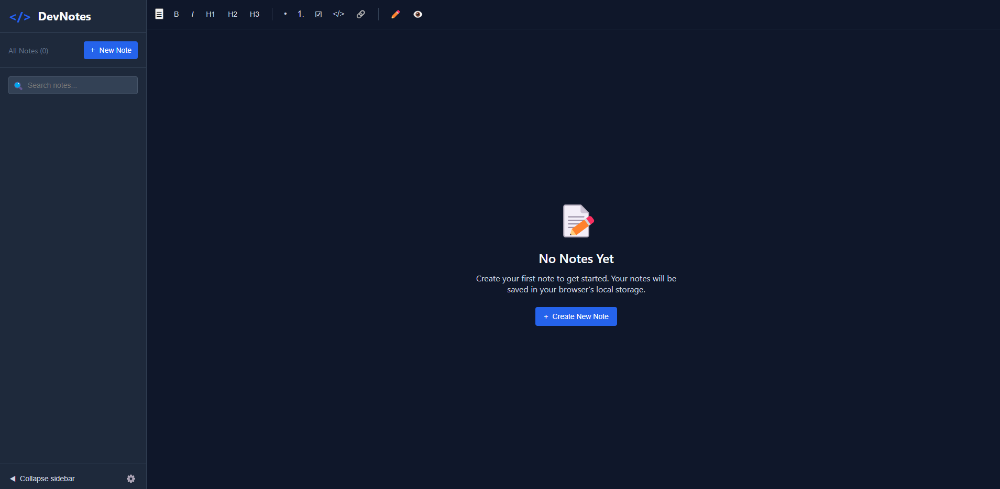

# DevNotes - The Ultimate Note-Taking App for Developers

DevNotes is a powerful and intuitive note-taking application tailored for developers. Whether you're storing code snippets, brainstorming ideas, or drafting technical documentation, DevNotes provides a seamless experience with a rich feature set and a sleek, modern interface.

---

## 🚀 Features

- **📝 Rich Text Editing** – Format your notes effortlessly with bold, italics, headings, lists, and more.
- **💻 Code Blocks** – Insert and highlight code snippets with syntax highlighting for better readability.
- **📄 Markdown Support** – Write in Markdown and preview your notes in real-time.
- **💾 Local Storage** – Your notes are securely saved in your browser's local storage.
- **🔎 Powerful Search** – Quickly find notes with an intuitive search feature.
- **⚙️ Customizable Settings** – Adjust auto-save intervals, font size, and other preferences.
- **📤 Export Options** – Save notes in Markdown, Plain Text, or HTML formats.
- **📱 Responsive Design** – Enjoy a seamless experience on both desktop and mobile devices.

---

## 📌 Getting Started

1. **Create a New Note** – Click the "New Note" button, add a title, choose a category, and tag your note.
2. **Edit & Format** – Use the toolbar for text formatting, inserting code blocks, and adding lists.
3. **Preview Mode** – Switch to preview mode to see your Markdown-rendered notes in real-time.
4. **Save & Organize** – Your notes are automatically saved. Use the search bar for quick access.
5. **Export & Share** – Export your notes in various formats or clear data as needed.

---

## 🌍 Contributing

We welcome community contributions! If you have ideas, bug reports, or feature requests, feel free to open an issue or submit a pull request.

---

## 🎯 Stay Organized, Stay Efficient!

**DevNotes** is your perfect companion for structured and efficient note-taking. Keep your thoughts organized and your code snippets handy. Happy coding! 🚀